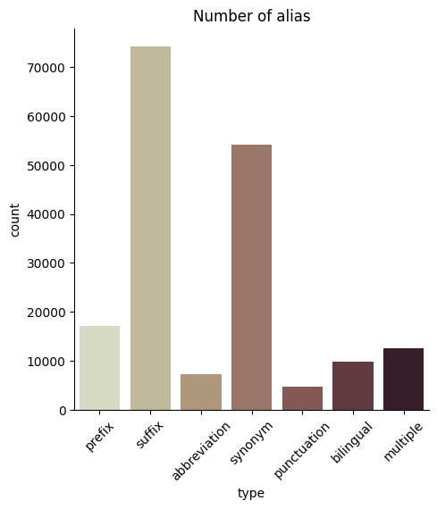

README

This is the repository for our unsupervised alias generation task.

We utilize pretrained language model(e.g. GPT2) to generate possible mentions for a word.

Here are the packages:

- demo
  - You can try out some examples here.
- src

# 1. Interesting Result

## 1.1 Reproduction

Using the **same parameters** may get **different outputs:**(2021/10/29) 

I think this is caused by our decoding strategy which is sampling. If we set the random seed, it will generate the same output:(2021/11/2) 

## 1.2 Try different patterns

Here is the result of different patterns:

## 1.3 Beam search with CPM2

Here is the result for `num_beams = 2`:

For `num_beams = 8`:

Well, maybe some results are relevant. But it is strange that :

- Some template can not generate enough beams.
- When `num_beams` get larger, the results get worse.

# 2. Dataset

## 2.1 Reverse `xlink` table

We reverse the entity linking relations and get the map between  the entity id and mentions (See `README` under `src`).

Here are some types which frequently appear in the result:

| Type           | example                                                      | Noise  |
| -------------- | ------------------------------------------------------------ | ------ |
| Multiple alias | bdi13132852::=纽约大学::=美国纽约大学::=new york university::=nyu | NO     |
| Bilingual      | bdi12962206::=滨田麻里::=滨田マリ                            | NO     |
| Prefix         | bdi3680860::=移动定制手机::=中国移动定制机 bdi8362196::=夏宫::=彼得大帝夏宫 | NO     |
| Suffix         | bdi17597962::=永夜城::=永夜城（短篇小说） bdi4004751::=北京大北宾馆::=北京大北宾馆（大望路店） | NO     |
| Abbreviation   | bdi18479549::=国动委::=国家国防动员委员会                    | NO     |
| Synonym        | bdi4049370::=波尔多红酒::=波尔多葡萄酒                       | NO     |
| Punctuation    | bdi4611038::=洛奇::=《洛奇》                                 | NO     |
| One to all     | bdi14804606::=万达广场::=厦门湖里万达广场 bdi14805470::=万达广场::=苏州万达广场 bdi14805482::=万达广场::=莆田万达广场 | YES/NO |

## 2.2 Definition of `hasAlias`

We know that a mention may be correspond to different entities, like `万达广场`, we call them `surjective alias`, the mention which has only one corresponding entity is called `injective alias`, like `番茄钟`: 

Let $e$ denote the entity, $w$ denote the word, $W_e$ denote the set of $e$'s injective alias.

If $w$ only  corresponds to one entity $e$ ,  then for any word $w_i \in W_e$,   $w$  `hasAlias` $w_i$ and $w_i$  `hasAlias` $w$.  Also,  $w \in W_e$ 

If  $w$  corresponds to a set of entities $E_w$,   then for the entity $e_i \in E_w$ , $e_i$ has a set of injective alias $W_{e_i}$, for all the injective alias $w_{j} \in W_{e_i}$,  $w_i$  `hasAlias` $w$.  

Here is the distribution of different alias types:

# 3. Ways of few shot prompt

## 3.1 task-specific prefix

without task-specific prefix prompt:

with task-specific prefix prompt:

with wrong task prefix prompt (Transfer from synonym to abbreviation):

### 3.1.1 Evaluation result

**Randomly** sample  alias words and use 4 template` ['也被称为', '的别名是', '的缩写为', ',简称']` to generate 4 prompt prefix and each prefix will be feed into `cpm2` to get a predict target word.  

| alias_type   | max_tokens | decode | EM 4@1  | True_contain 4@1 |
| ------------ | ---------- | ------ | ------- | ---------------- |
| prefix       | 2          | sample | 0.06495 | 0.6922           |
| suffix       | 4          | sample | 0.43980 | 2.7388           |
| abbreviation | 2          | sample | 0.02621 | 0.1890           |
| abbreviation | 2          | beam=2 | 0.00414 | 0.0648           |
| synonym      | 2          | beam=2 | 0.00240 | 0.0429           |
| synonym      | 4          | sample | 0.00996 | 0.1329           |
| punctuation  | 4          | sample | 1.65393 | 1.6539           |

change `task_specific_prompt_num` and `task_definition`

`task_definition` is the prefix like: `接下来进行别名生成，比如xx也叫yy`

| alias_type | task_specific_prompt_num | task_definition | EM 4@1  | True_contain 4@1 |
| ---------- | ------------------------ | --------------- | ------- | ---------------- |
| prefix     | 4                        | false           | 0.06495 | 0.6922           |
| prefix     | 2                        | false           | 0.05734 | 0.5840           |
| prefix     | 1                        | false           | 0.03043 | 0.2557           |
| prefix     | 2                        | true            | 0.05734 | 0.6080           |
| prefix     | 4                        | true            | 0.05383 | 0.6799           |
| prefix     | 8                        | true            | 0.05208 | 0.7297           |
| synonym    | 8                        | true            | 0.03100 | 0.3990           |
| synonym    | 8                        | false           | 0.04300 | 0.3890           |