README

This is the repository for our unsupervised alias generation task.

We utilize pretrained language model(e.g. GPT2) to generate possible mentions for a word.

Here are the packages:

- demo
  - You can try out some examples here.
- src


# 1. Interesting Result

## 1.1 Reproduction

Using the **same parameters** may get **different outputs:**(2021/10/29) 

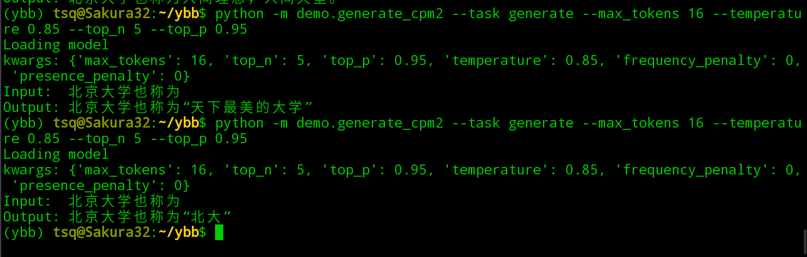

I think this is caused by our decoding strategy which is sampling. If we set the random seed, it will generate the same output:(2021/11/2) 

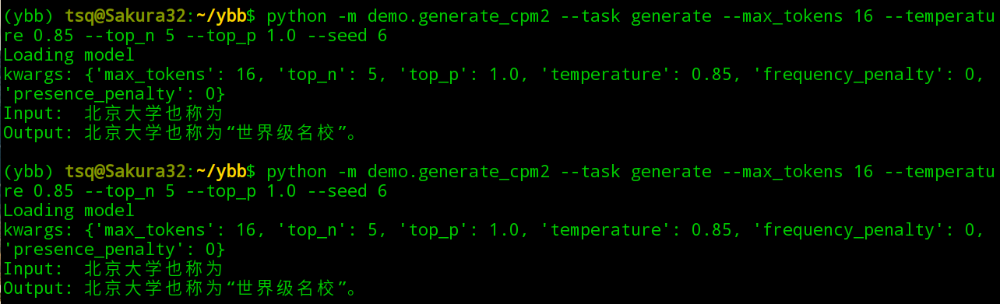

## 1.2 Try different patterns

Here is the result of different patterns:

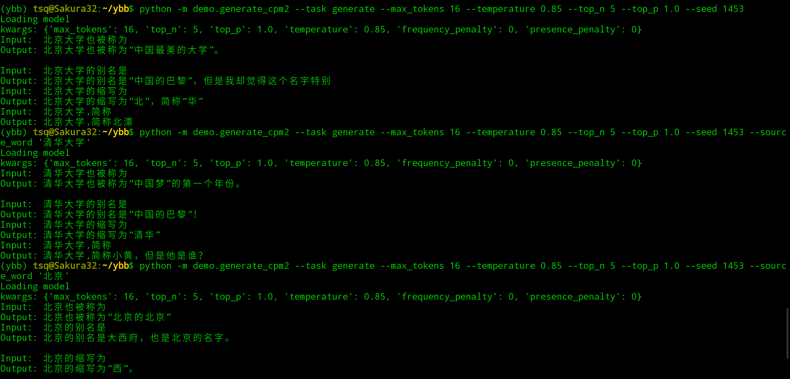

## 1.3 Beam search with CPM2

Here is the result for `num_beams = 2`:

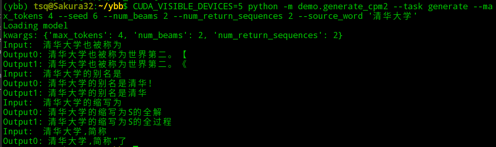

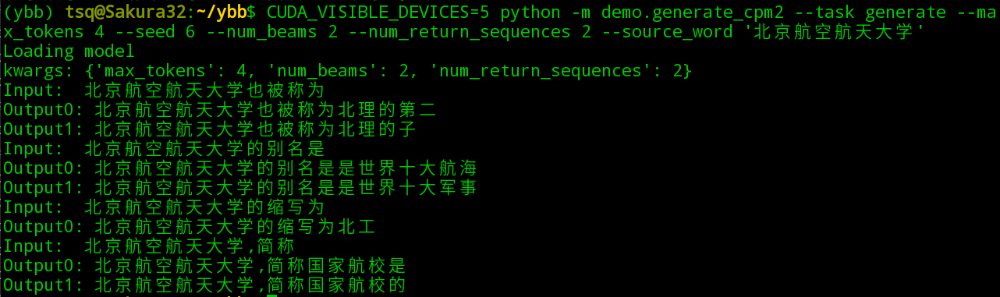

For `num_beams = 8`:

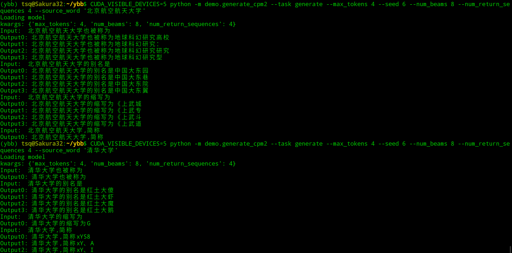

Well, maybe some results are relevant. But it is strange that :

- Some template can not generate enough beams.
- When `num_beams` get larger, the results get worse.


# 2. Dataset

## 2.1 Reverse `xlink` table

We reverse the entity linking relations and get the map between  the entity id and mentions (See `README` under `src`).

Here are some types which frequently appear in the result:

| Type           | example                                                      | Noise  |
| -------------- | ------------------------------------------------------------ | ------ |
| Multiple alias | bdi13132852::=纽约大学::=美国纽约大学::=new york university::=nyu | NO     |
| Bilingual      | bdi12962206::=滨田麻里::=滨田マリ                            | NO     |
| Prefix         | bdi3680860::=移动定制手机::=中国移动定制机<br/>bdi8362196::=夏宫::=彼得大帝夏宫 | NO     |
| Suffix         | bdi17597962::=永夜城::=永夜城（短篇小说）<br/>bdi4004751::=北京大北宾馆::=北京大北宾馆（大望路店） | NO     |
| Abbreviation   | bdi18479549::=国动委::=国家国防动员委员会                    | NO     |
| Synonym        | bdi4049370::=波尔多红酒::=波尔多葡萄酒                       | NO     |
| Punctuation    | bdi4611038::=洛奇::=《洛奇》                                 | NO     |
| One to all     | bdi14804606::=万达广场::=厦门湖里万达广场<br/>bdi14805470::=万达广场::=苏州万达广场<br/>bdi14805482::=万达广场::=莆田万达广场 | YES/NO |

## 2.2 Definition of `hasAlias`

We know that a mention may be correspond to different entities, like `万达广场`, we call them `surjective alias`, the mention which has only one corresponding entity is called `injective alias`, like `番茄钟`: 

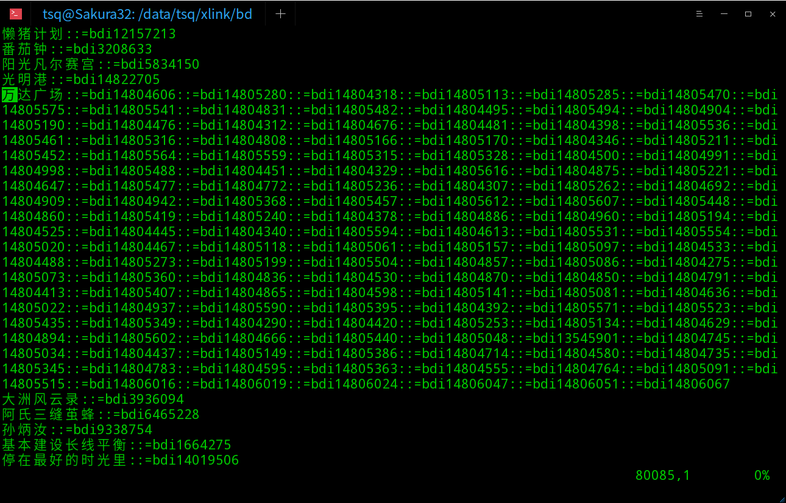

Let $e$ denote the entity, $w$ denote the word, $W_e$ denote the set of $e$'s injective alias.

If $w$ only  corresponds to one entity $e$ ,  then for any word $w_i \in W_e$,   $w$  `hasAlias` $w_i$ and $w_i$  `hasAlias` $w$.  Also,  $w \in W_e$ 

If  $w$  corresponds to a set of entities $E_w$,   then for the entity $e_i \in E_w$ , $e_i$ has a set of injective alias $W_{e_i}$, for all the injective alias $w_{j} \in W_{e_i}$,  $w_i$  `hasAlias` $w$.  

Here is the distribution of different alias types:

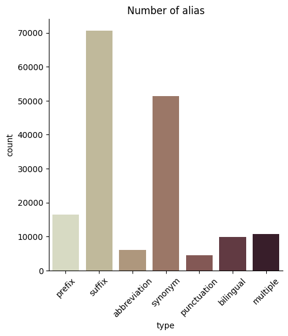

# 3. Ways of few shot prompt

## 3.1 task-specific prefix

without task-specific prefix prompt:

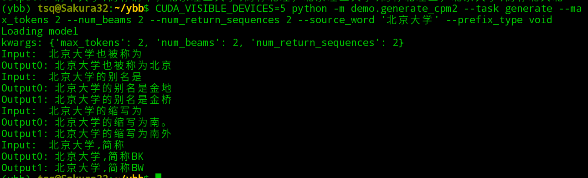

with task-specific prefix prompt:

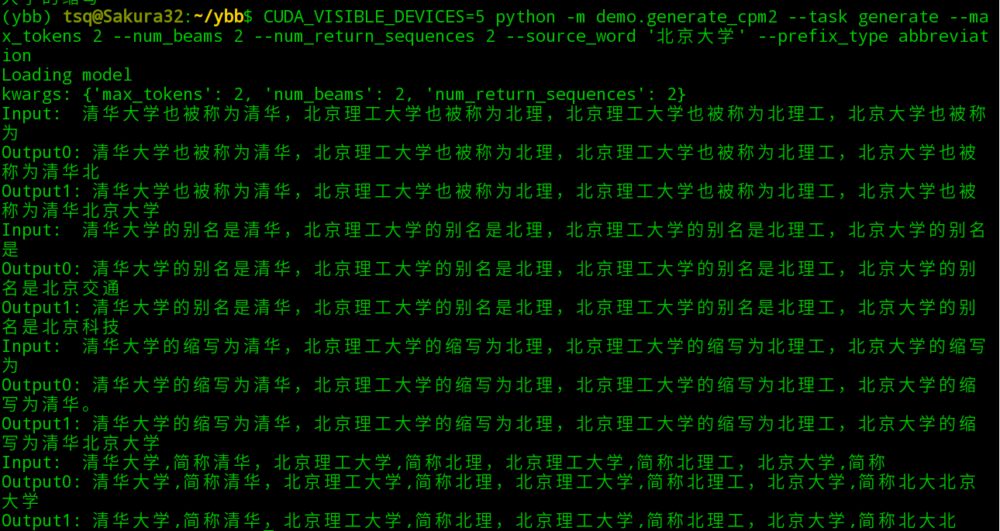

with wrong task prefix prompt (Transfer from synonym to abbreviation):

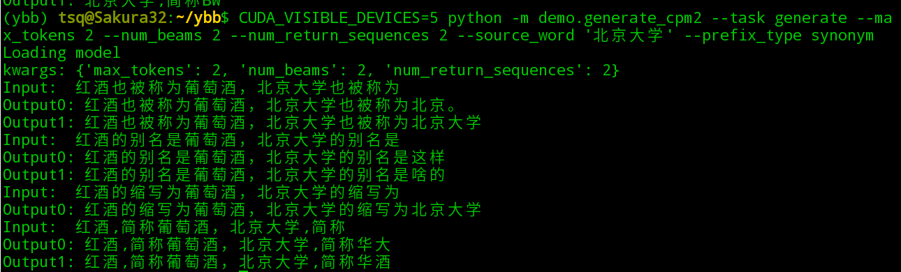

### 3.1.1 Evaluation result

**Randomly** sample  alias words and use 4 template` ['也被称为', '的别名是', '的缩写为', ',简称']` to generate 4 prompt prefix and each prefix will be feed into `cpm2` to get a predict target word.  

| alias_type   | max_tokens | decode | EM 4@1  | True_contain 4@1 |
| ------------ | ---------- | ------ | ------- | ---------------- |
| prefix       | 2          | sample | 0.06495 | 0.6922           |
| suffix       | 4          | sample | 0.43980 | 2.7388           |
| abbreviation | 2          | sample | 0.02621 | 0.1890           |
| abbreviation | 2          | beam=2 | 0.00414 | 0.0648           |
| synonym      | 2          | beam=2 | 0.00240 | 0.0429           |
| synonym      | 4          | sample | 0.00996 | 0.1329           |
| punctuation  | 4          | sample | 1.65393 | 1.6539           |

change `task_specific_prompt_num` and `task_definition`

`task_definition` is the prefix like: `接下来进行别名生成，比如xx也叫yy`

| alias_type | task_specific_prompt_num | task_definition | EM 4@1  | True_contain 4@1 |
| ---------- | ------------------------ | --------------- | ------- | ---------------- |
| prefix     | 4                        | false           | 0.06495 | 0.6922           |
| prefix     | 2                        | false           | 0.05734 | 0.5840           |
| prefix     | 1                        | false           | 0.03043 | 0.2557           |
| prefix     | 2                        | true            | 0.05734 | 0.6080           |
| prefix     | 4                        | true            | 0.05383 | 0.6799           |
| prefix     | 8                        | true            | 0.05208 | 0.7297           |
| synonym    | 8                        | true            | 0.03100 | 0.3990           |
| synonym    | 8                        | false           | 0.04300 | 0.3890           |

In the past, one template only generate one word.

Now we will generate more result for one template.

| alias_type | decode  | EM 6@10 | True_contain 6@10 |
| ---------- | ------- | ------- | ----------------- |
| prefix     | sample  | 0.22469 | 1.74956           |
| prefix     | beam=10 | 0       | 0.12814           |
| prefix     | beam=16 | 0       | 0.18432           |

@50

| alias_type   | decode | n    | EM 4@n | True_contain 4@n |
| ------------ | ------ | ---- | ------ | ---------------- |
| synonym      | sample | 10   | 0.145  | 0.21             |
| synonym      | sample | 50   | 0.27   | 0.35             |
| abbreviation | sample | 50   | 0.195  | 0.5              |

pattern number

| alias_type | decode | pattern_num | EM pn@10 | True_contain pn@10 |
| ---------- | ------ | ----------- | -------- | ------------------ |
| synonym    | sample | 4           | 0.145    | 0.21               |
| synonym    | sample | 6           | 0.24     | 0.345              |

Now, we find that the pattern number may help more, we will create more template and try again. Because the `EM pn@n `is not a good measurement due to its bias with right results' number. We will use `best_EM` (means that the results have at lease one Exact Match) which has a max value 1 with each input.

| alias_type | pattern_num | n    | top_n_range | max_tokens_scale | best_EM | best_True |
| ---------- | ----------- | ---- | ----------- | ---------------- | ------- | --------- |
| synonym    | 4           | 10   | None        | None             | 0.065   | 0.095     |
| synonym    | 4           | 50   | None        | None             | 0.09    | 0.115     |
| synonym    | 6           | 10   | None        | None             | 0.07    | 0.1       |
| synonym    | 6           | 20   | 2           | 2                | 0.085   | 0.255     |
| synonym    | 6           | 20   | 2           | 1.5              | 0.05    | 0.28      |
| synonym    | 6           | 20   | 1           | 1.5              | 0.04    | 0.26      |
| synonym    | 6           | 20   | 1           | 2                | 0.07    | 0.275     |
| synonym    | 6           | 50   | 2           | 2                | 0.11    | 0.33      |
| synonym    | 6           | 50   | 4           | 2                | 0.115   | 0.325     |

add redundancy & punctuation strategy

(default: top_n_range=2 max_tokens_scale=2 pattern_num=6)

| alias_type | n             | punctuation | best_EM | best_True |
| ---------- | ------------- | ----------- | ------- | --------- |
| synonym    | 20            | None        | 0.085   | 0.255     |
| synonym    | 40(return 20) | None        | 0.035   | 0.305     |
| synonym    | 20            | lazy        | 0.175   | 0.195     |
| synonym    | 20            | all         | 0.125   | 0.155     |

using `set` to remove redundancy and check the separated_char in the striped string:

(default: top_n_range=4 max_tokens_scale=2 pattern_num=6)

| alias_type | n                          | redundancy          | punctuation | best_EM | best_True |
| ---------- | -------------------------- | ------------------- | ----------- | ------- | --------- |
| synonym    | 20                         | None                | None        | 0.085   | 0.255     |
| synonym    | 40(return 20)              | None                | None        | 0.075   | 0.29      |
| synonym    | 40(return 20)              | None                | lazy        | 0.16    | 0.205     |
| synonym    | 20                         | None                | lazy        | 0.185   | 0.215     |
| synonym    | 20                         | None                | all         | 0.18    | 0.22      |
| synonym    | 20                         | max_overlap_scale=1 | lazy        | 0.195   | 0.255     |
| synonym    | 20(return all)<br/>avg: 27 | max_overlap_scale=1 | lazy        | 0.26    | 0.285     |
| synonym    | 20                         | max_overlap_scale=1 | all         | 0.195   | 0.23      |
| synonym    | 40(return 20)              | max_overlap_scale=2 | lazy        | 0.03    | 0.275     |
| synonym    | 40(return 20)              | max_overlap_scale=1 | lazy        | 0.16    | 0.26      |

Different alias type domain:

(default: top_n_range=4 max_tokens_scale=2 pattern_num=6 num_return_sequences all num_generate_sequences=50 max_overlap_scale=1 punctuation_strategy=lazy example_num=2000)

| alias_type   | pattern_num | avg_num_generate_sequences | best_EM | best_True |
| ------------ | ----------- | -------------------------- | ------- | --------- |
| synonym      | 6           | 62.49666666666667          | 0.31    | 0.33      |
| abbreviation | 4           | 74.1275                    | 0.26    | 0.325     |
| prefix       | 6           | 61.9475                    | 0.595   | 0.725     |
| suffix       | 4           | 63.8425                    | 0.855   | 0.875     |
| punctuation  | 5           | 50.876                     | 0.765   | 0.835     |

### 3.1.2 Case study

- The correlation between sampled alias_table and generated tgt_word is very high, for example:

  - ``` json
       {
            "iter": 60,
          		"src_word": "吴子兵法",
            "golden": "吴起兵法",
            "pred": [
                    "吴子兵",
                    "华农兄弟",
                    "吴子兵，华农兄弟",
                    "吴子兵",
                    "吴子兵的中国音乐",
                    "中国乐坛",
                    "中国",
                    "吴子兵，吴子兵的中国音乐，中国乐坛，中国",
                    "王宝合的同义",
                    "吴亦凡，王宝合的同义",
                    "吴亦凡的“吴子兵”",
                ],
            "alias_table": {
                "王宝合": [
                    "鬼手"
                ],
                "华语歌坛": [
                    "华语乐坛"
                ],
                "反坦克枪": [
                    "反坦克步枪"
                ],
                "光子": [
                    "光量子"
                ]
          		 }
          	}
    ```

    - Although "华语歌坛" -> ''华语乐坛'  provide an example of synonym, it is not in the same domain  with "吴子兵法". So it brings some strange semantic which puzzles the Language Model.

  - **Possible Solution**: Maybe we should find the example alias with **similar semantic** that our `src_word `has.

    - We may not randomly sample examples but provide a small example database with words from different domains. 
    - As for how to create the database, I think **k-means clustering** may be reasonable. We can use the word in the cluster center to represent the cluster.
    - We can calculate the semantic similarity between the input `src_word ` and the words in the database to find out the most similar examples. Then we use these examples as prompt.

- **Chinese Name Generation** is very hard, for example:  

  - ```json
     {
            "iter": 10,
            "src_word": "郑光祖",
            "golden": "郑德辉",
            "pred": [
                [
                    "郑光祖",
                    "王一郑光祖",
                    "郑光",
                    "郑光祖，王一郑光祖，郑光",
                    "郑光祖。这个郑光祖",
                    "郑光祖",
                    "这个郑光祖，郑光",
                    "郑光祖。这个郑光祖，郑光",
                    "郑光祖郑光祖",
                    "郑郑"
                ]
            ]
    }
    ```

    - In fact, we check the `Baidu Baike` and find that :

      - 郑光祖（1264年—？） ，字德辉，汉族，[平阳](https://baike.baidu.com/item/平阳/3819506)[襄陵](https://baike.baidu.com/item/襄陵/6852152)（今山西[临汾市](https://baike.baidu.com/item/临汾市/529505)[襄汾县](https://baike.baidu.com/item/襄汾县/490791)）人，元代著名[杂剧](https://baike.baidu.com/item/杂剧/827051)家、[散曲](https://baike.baidu.com/item/散曲/295113)家。

    - In Info box:

      - 中文名

        郑光祖

        别  名

        郑德辉

    - So, if we want to overcome the alias type like someone's `字`  . We should provide the prompt pattern like `src_name ，字 ` and the generated word should be concatenated  with the `src_name`'s last name.

## 3.2 alias data

use support set as alias_data_source & sample different tables for one src_word

(default: top_n_range=4 max_tokens_scale=2 pattern_num=4 num_return_sequences all num_generate_sequences=50 max_overlap_scale=1 punctuation_strategy=lazy example_num=2000)

| alias_type   | alias_data_source | alias_table_num | best_EM | best_True |
| ------------ | ----------------- | --------------- | ------- | --------- |
| abbreviation | support_pool=20   | 4               |         |           |
| abbreviation | support_pool=20   | 2               |         |           |
| abbreviation | whole_dataset     | 4               |         |           |
| abbreviation | whole_dataset     | 2               |         |           |